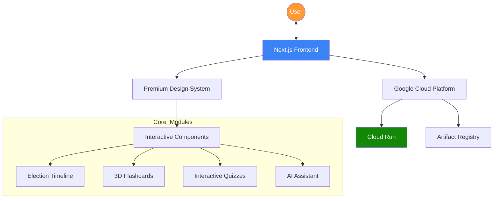
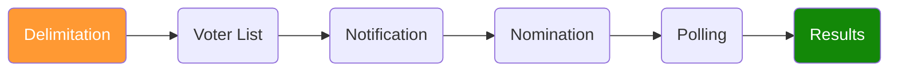

# 🇮🇳 DemocracyLens

**DemocracyLens** is a premium, interactive educational platform designed to simplify and demystify the Indian Election System. Built with a mobile-first philosophy, it transforms complex electoral processes into engaging, bite-sized learning modules through timelines, interactive flashcards, and AI-powered assistance.

## 🚀 Live Demo
Experience the app live: **[democracy-lens.run.app](https://democracy-lens-574005567405.us-central1.run.app)**

---

## ✨ Key Features

- **📍 Interactive Timeline**: A step-by-step visual journey of the election lifecycle, from Delimitation to Result declaration.
- **🃏 3D Study Flashcards**: Master terminology like EVM, VVPAT, and MCC with interactive, swipeable flip-cards.
- **🧠 Knowledge Quizzes**: Test your electoral IQ with instant feedback and detailed explanations.
- **💬 AI Chat Assistant**: A simulated intelligent assistant to answer real-time queries about the democratic process.
- **📱 Mobile-First UX**: Native-feeling navigation with a **Bottom Tab Bar**, full-screen menus, and haptic-like touch feedback.
- **🎨 Premium Aesthetic**: Sleek dark-mode design featuring glassmorphism, vibrant gradients, and smooth micro-animations.

---

## 🏗 System Architecture



---

## 🗳 The Electoral Journey



---

## 🛠 Tech Stack

- **Framework**: [Next.js 16](https://nextjs.org/) (App Router)
- **Styling**: Vanilla CSS & [Tailwind CSS v4](https://tailwindcss.com/)
- **Icons**: [Lucide React](https://lucide.dev/)
- **Deployment**: [Google Cloud Run](https://cloud.google.com/run)
- **CI/CD**: Google Cloud Build

---

## 📦 Getting Started

### Prerequisites
- Node.js 20+
- npm

### Installation
1. Clone the repository:
   ```bash
   git clone https://github.com/thenikhilbisht/DemocracyLens.git
   ```
2. Install dependencies:
   ```bash
   npm install
   ```
3. Run the development server:
   ```bash
   npm run dev
   ```
4. Open [http://localhost:3000](http://localhost:3000) in your browser.

---

## 📜 License
This project was built as part of the **Prompt Wars Challenge**. All rights reserved to the author. Built with ❤️ for the world's largest democracy.
