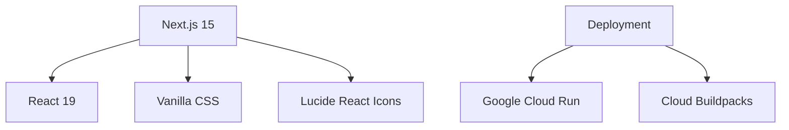
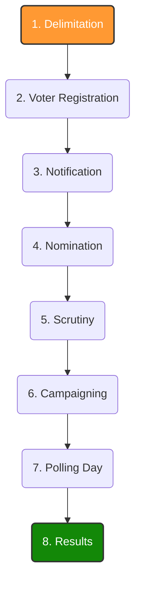

# 🇮🇳 DemocracyLens

**DemocracyLens** is a modern, interactive web application designed to simplify and educate users about the Indian Election System. Built with Next.js and a premium design system, it breaks down complex electoral processes into bite-sized, engaging modules.

## 🚀 Live Demo
Experience the app live: **[https://election-assistant-574005567405.us-central1.run.app](https://election-assistant-574005567405.us-central1.run.app)**

---

## ✨ Key Features

- **Interactive Timeline**: A step-by-step journey of the election process, from Delimitation to Results.
- **Study Flashcards**: Master key terminology like EVM, VVPAT, and Model Code of Conduct with 3D flip-cards.
- **Knowledge Quizzes**: Test your understanding with multiple-choice quizzes and detailed explanations.
- **Election Assistant Chat**: A simulated AI chatbot to answer specific questions about voter registration and election rules.
- **Premium UI**: Dark mode support, glassmorphism, and smooth micro-animations.

---

## 🛠 Tech Stack



---

## 🗳 The Election Process

Here is the journey of an election in India as presented in the app:



---

## 📦 Getting Started

### Prerequisites
- Node.js 18+
- npm or yarn

### Installation
1. Clone the repository:
   ```bash
   git clone https://github.com/thenikhilbisht/DemocracyLens.git
   ```
2. Install dependencies:
   ```bash
   npm install
   ```
3. Run the development server:
   ```bash
   npm run dev
   ```
4. Open [http://localhost:3000](http://localhost:3000) in your browser.

---

## 🏗 Project Structure

- `src/app`: Next.js App Router pages and layouts.
- `src/components`: Reusable UI components (Navbar, Footer, etc.).
- `src/data`: Mock data for timelines, quizzes, and flashcards.
- `src/app/globals.css`: Premium design system and utility classes.

---

## 📜 License
This project is for educational purposes. Built with ❤️ for Indian Democracy.
